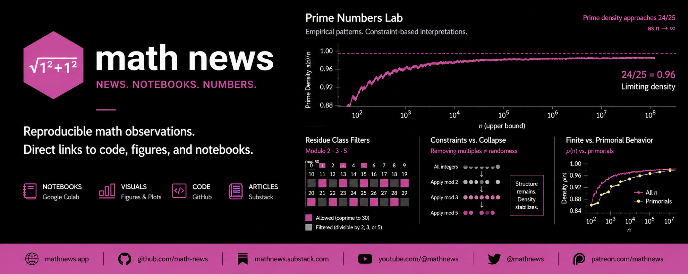

# Math News



## Definition

**Math News publishes reproducible math observations with direct links to code, figures, and notebooks.**

---

## Overview

Math News is a structured, ongoing publication built from real computational work.

Each entry:

* states a concrete mathematical observation
* links directly to code (Colab / Python)
* includes supporting figures
* remains minimal, testable, and reproducible

---

## Core Focus

### Prime Numbers (initial series)

* Empirical density behavior
* Residue class filtering (mod 2, 3, 5, …)
* Constraint vs. collapse dynamics
* Finite vs. primorial comparisons

Key observation:

> Prime density stabilizes near **24/25 ≈ 0.96** under finite modular constraints.

---

## Repository Structure

```
math-news/
├── README.md
├── posts/
│   ├── 0001_prime_density_24_25.md
│   ├── 0002_residue_filters.md
│   └── ...
├── notebooks/
│   ├── prime-numbers-lab/
│   └── ...
├── figures/
├── images/
│   └── MATH_NEWS_banner.png
├── docs/        # site (mathnews.app)
└── data/
```

---

## Workflow

```
Notebook → Figure → Observation → Post → Distribution
```

* **Notebook**: source computation (Colab)
* **Figure**: visual evidence
* **Observation**: concise claim
* **Post**: readable write-up (Substack)
* **Distribution**: social / video

---

## Links (to be populated)

* Site: [https://mathnews.app](https://mathnews.app)
* GitHub: [https://github.com/thinkthoughts/math-news](https://github.com/thinkthoughts/math-news)
* Substack: [https://mathnews.substack.com](https://mathnews.substack.com)
* YouTube: [https://youtube.com/@mathnews](https://youtube.com/@danhawkley)
* Patreon: [https://patreon.com/mathnews](https://patreon.com/mathnews)

---

## Style

* minimal language
* direct claims
* no abstraction without computation
* figures over paragraphs

---

## Notation

📐 √(1² + 1²)

Used as a geometric reference for constraint alignment.

---

## License

MIT (or to be defined)

---

## Status

Initialization phase.

Prime Numbers series → first publication set.
